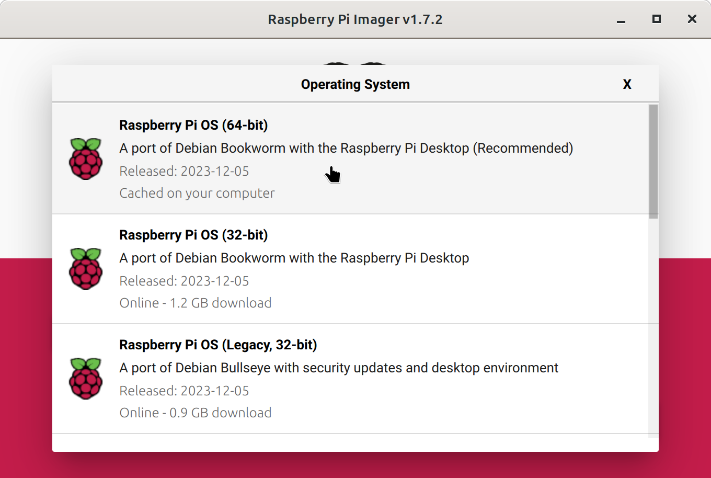
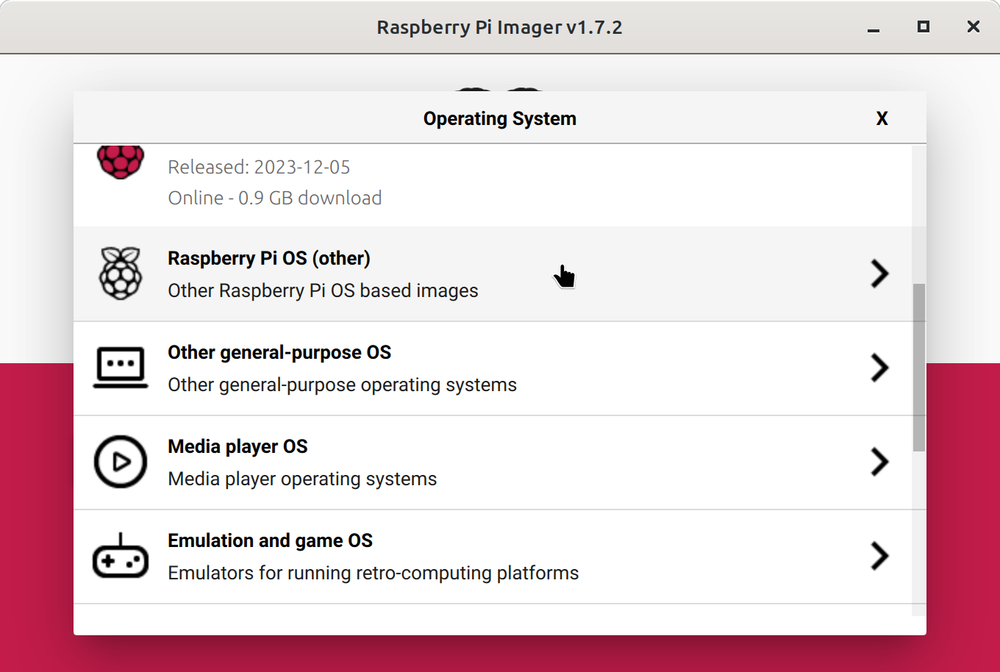
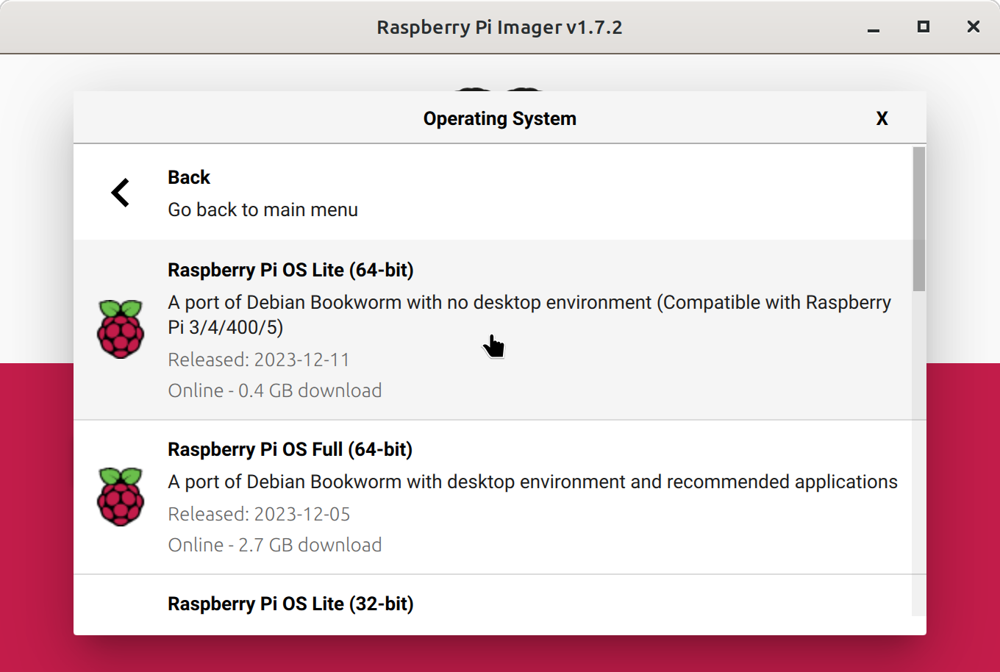

# papertty-init
Installer scripts for PaperTTY

This repo is a work-in-progress and not ready for use yet.


GUI installer



Install

```bash
bash -c "$(curl https://sh.mcarr.dev/gui)"
```

or

```bash
bash -c "$(curl https://raw.githubusercontent.com/mcarr823/papertty-init/main/gui.sh)"
```


CLI installer





Install

```bash
bash -c "$(curl https://sh.mcarr.dev/cli)"
```

or

```bash
bash -c "$(curl https://raw.githubusercontent.com/mcarr823/papertty-init/main/cli.sh)"
```